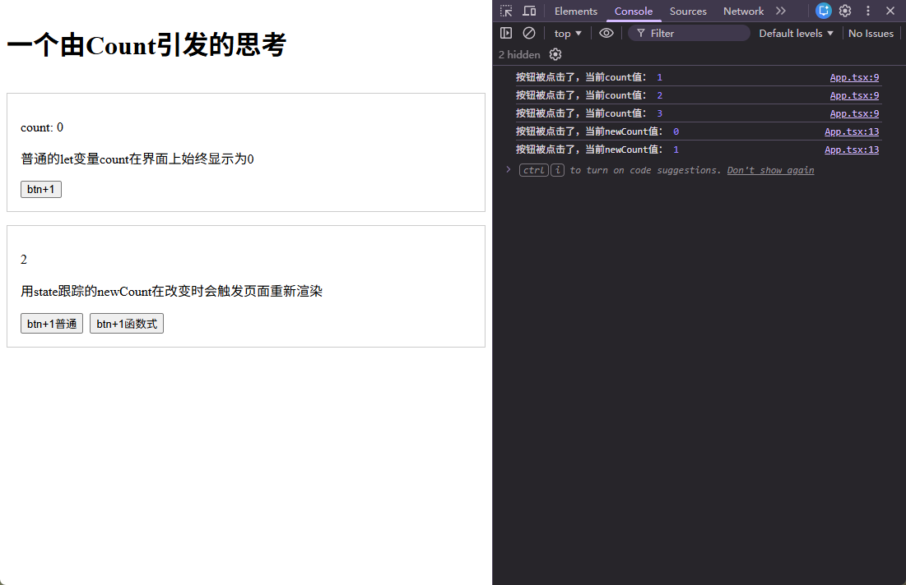
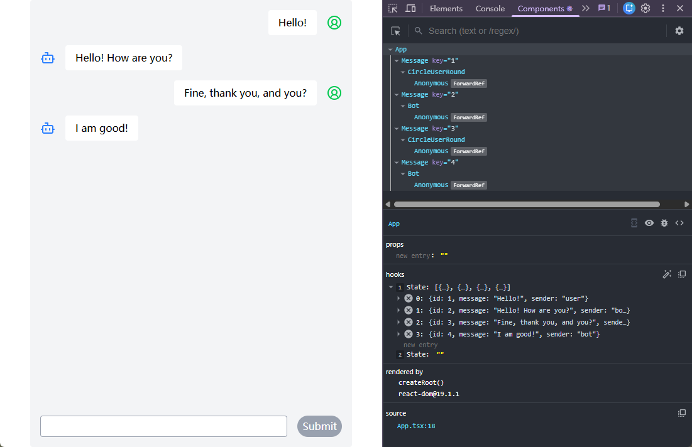

[← 返回首页](../readme.md)

# 第五章 - useState：用状态驱动 UI

前几章我们写的组件都是"静态"的——数据写死在代码里，界面不会变化。真实的应用需要响应用户操作：用户输入内容、点击按钮，界面随之更新。`useState` 是 React 中管理这类动态数据的基础工具。

本章提供两个案例：

- 案例一：[codes/demo01](codes/demo01) — useState 原理与函数式更新
- 案例二：[codes/demo02](codes/demo02) — 简易聊天机器人

## 目录

**案例一**

1. [为什么不能用普通变量](#1-为什么不能用普通变量)
2. [useState 基本语法](#2-usestate-基本语法)
3. [普通更新 vs 函数式更新](#3-普通更新-vs-函数式更新)

**案例二**

4. [需求与设计](#4-需求与设计)
5. [第一步：设计数据结构](#5-第一步设计数据结构)
6. [第二步：搭建聊天界面 UI](#6-第二步搭建聊天界面-ui)
7. [第三步：跟踪输入框内容](#7-第三步跟踪输入框内容)
8. [第四步：实现发送消息](#8-第四步实现发送消息)
9. [第五步：清空初始数据](#9-第五步清空初始数据)
10. [遗留问题](#10-遗留问题)

---

## 案例一：useState 原理与函数式更新

> 示例代码：[codes/demo01/src/App.tsx](codes/demo01/src/App.tsx)

### 1. 为什么不能用普通变量

先看一个问题：如果用普通变量来记录数据，会怎样？

```tsx
function App() {
  let count = 0;

  function handleClick() {
    count = count + 1;
    console.log("当前 count：", count); // 控制台能看到新值
  }

  return (
    <div>
      <p>{count}</p> {/* 但页面永远显示 0 */}
      <button onClick={handleClick}>+1</button>
    </div>
  );
}
```

点击按钮，`count` 在内存里确实变了，控制台也能印证——但页面不会更新。原因：**React 不知道变量改了**。React 只会在两种情况下重新渲染组件：父组件重新渲染，或者组件自己的 state 发生变化。普通变量的修改对 React 是不可见的。

---

### 2. useState 基本语法

```tsx
import { useState } from "react";

const [newCount, setNewCount] = useState(0);
```

`useState` 返回一个数组，用解构赋值取出两个值：

|        | 名称        | 说明                                 |
| ------ | ----------- | ------------------------------------ |
| 第一项 | state 变量  | 当前的值，只读                       |
| 第二项 | setter 函数 | 修改值的唯一方式，调用后触发重新渲染 |
| 参数   | 初始值      | 组件第一次渲染时的值，之后忽略       |

命名约定：`[xxx, setXxx]`，setter 名字加 `set` 前缀。

```tsx
// ❌ 直接赋值，React 感知不到，页面不会更新
newCount = newCount + 1;

// ✅ 通过 setter，React 收到通知，触发重新渲染
setNewCount(newCount + 1);
```

调用 setter 后，React 会重新执行组件函数，`newCount` 拿到新值，返回新的 JSX，页面随之更新。

---

### 3. 普通更新 vs 函数式更新

现在有一个需求：点一次按钮，让计数器加 3。直觉上会这样写：

```tsx
function handleClick2() {
  setNewCount(newCount + 1); // 期望 0 → 1
  setNewCount(newCount + 1); // 期望 1 → 2
  setNewCount(newCount + 1); // 期望 2 → 3
}
```

实际运行后会发现：点一次按钮，计数器只加了 1，不是 3。

**原因：React 的批处理机制**

React 为了性能，会把同一个事件回调中的多次 `setState` 调用**合并**（batch）处理，等事件结束后统一渲染一次。这意味着在 `handleClick2` 执行的整个过程中，`newCount` 的值始终是调用前的那个快照——假设当前是 `0`，那么三行代码都在计算 `0 + 1`，结果都是 `1`，合并后只更新成 `1`。

```tsx
// newCount 当前是 0
setNewCount(newCount + 1); // 0 + 1 = 1
setNewCount(newCount + 1); // 0 + 1 = 1（仍然是旧值！）
setNewCount(newCount + 1); // 0 + 1 = 1（仍然是旧值！）
// 最终结果：1，不是 3
```

**解决方案：函数式更新**

setter 除了接收新值，还可以接收一个**更新函数**。React 会把这些更新函数放入队列，依次执行，每一步都能拿到上一步更新后的最新值：

```tsx
function handleClick3() {
  setNewCount((prev) => prev + 1); // 0 → 1
  setNewCount((prev) => prev + 1); // 1 → 2
  setNewCount((prev) => prev + 1); // 2 → 3
  // 最终结果：3 ✅
}
```

`prev` 是 React 传入的"当前最新值"，每次都是上一个更新函数执行完之后的结果。

**什么时候用函数式更新：**

| 场景                         | 推荐写法                           |
| ---------------------------- | ---------------------------------- |
| 新值与当前 state 无关        | `setState(新值)`                   |
| 新值依赖当前 state           | `setState(prev => 基于prev的新值)` |
| 一次事件中多次更新同一 state | `setState(prev => ...)`            |

在案例二的聊天机器人中，我们把新消息追加到已有列表，新值依赖当前 state，所以应该用函数式更新。

**动手验证**

打开 demo01，按 F12 打开浏览器 DevTools，切换到 Console 面板，依次点击三个按钮，对照控制台输出观察：

- 点击 **btn+1**：`count` 在控制台里递增，但页面上始终显示 `0`
- 点击 **btn+1普通**：控制台打印的是点击时的旧值，页面上 `newCount` 每次只加 `1`（而不是 `3`）
- 点击 **btn+1函数式**：页面上 `newCount` 每次正确加 `3`



---

## 案例二：简易聊天机器人

> 示例代码：[codes/demo02/src/App.tsx](codes/demo02/src/App.tsx)

### 4. 需求与设计

**功能需求：**

- 展示对话历史
- 用户在输入框输入消息，点击发送后加入对话
- 机器人随机回复一条预设的回答
- 输入框为空时发送按钮不可点击

**涉及的 state：**

| state         | 类型            | 用途           |
| ------------- | --------------- | -------------- |
| `chatHistory` | `ChatMessage[]` | 所有对话记录   |
| `question`    | `string`        | 输入框当前内容 |

---

### 5. 第一步：设计数据结构

首先定义消息的数据结构，以及开发用的初始数据和机器人的备选回复：

```tsx
// 消息的数据结构
interface ChatMessage {
  id: number;
  message: string;
  sender: "user" | "bot";
}

// 用于开发阶段预览 UI 的初始对话
const initHistory: ChatMessage[] = [
  { id: 1, message: "Hello!", sender: "user" },
  { id: 2, message: "Hello! How are you?", sender: "bot" },
  { id: 3, message: "Fine, thank you, and you?", sender: "user" },
  { id: 4, message: "I am good!", sender: "bot" },
];

// 机器人的回复选项
// 呵呵，这是一个假机器人，不管你问什么问题，它只会回复这些“放之四海而皆准”的句子，是不是像极了现实中的一些管理者？
const replies: string[] = ["Interesting question!", "I'm not sure~", "What do you think?", "Haha, that's a tough one!", "Let me think..."];
```

`initHistory` 的作用是在 UI 搭建阶段提供真实感的测试数据，让页面看起来有内容，方便调整样式。等功能开发完成后再把它换成空数组。

---

### 6. 第二步：搭建聊天界面 UI

先用 `initHistory` 作为 `chatHistory` 的初始值，把界面搭出来：

```tsx
const [chatHistory, setChatHistory] = useState<ChatMessage[]>(initHistory);
```

整体布局分两块：上方可滚动的消息区域，下方固定的输入表单。

```tsx
return (
  <div className="max-w-lg w-full mx-auto h-screen rounded bg-gray-100 flex flex-col gap-4">
    {/* 消息区域 */}
    <div className="flex-1 overflow-y-auto flex flex-col gap-4 p-4">
      {chatHistory.map((chat) => (
        <Message key={chat.id} message={chat.message} sender={chat.sender} />
      ))}
    </div>

    {/* 输入表单 */}
    <form className="w-full flex gap-4 p-4">
      <input className="flex-1 border border-gray-400 bg-white rounded px-2 py-1" />
      <button type="submit" className="px-2 py-1 rounded-full bg-green-500 text-white">
        Submit
      </button>
    </form>
  </div>
);
```

**Message 组件**

消息列表中的每一条消息单独封装成 `Message` 组件，放在 `src/components/Message.tsx`。封装的好处是：消息的样式和逻辑集中在一处，`App.tsx` 里只需要用 `.map()` 循环渲染，不用关心每条消息长什么样。

```tsx
// src/components/Message.tsx
import { CircleUserRound, Bot } from "lucide-react";

interface MessageProps {
  message: string;
  sender: "user" | "bot";
}

export default function Message({ message, sender }: MessageProps) {
  const containerClass = `flex gap-4 items-center ${sender === "bot" ? "flex-row-reverse justify-end" : "justify-end"}`;

  return (
    <div className={containerClass}>
      <p className="bg-white py-2 px-4 rounded">{message}</p>
      {sender === "bot" ? <Bot className="text-blue-500" /> : <CircleUserRound className="text-green-500" />}
    </div>
  );
}
```

用户消息靠右对齐，机器人消息靠左对齐，通过 `sender` prop 来区分样式。

---

### 7. 第三步：跟踪输入框内容

UI 搭好了，现在要让输入框"活"起来。这里使用**受控输入**模式——把输入框的内容交给 React state 来管理，而不是让 DOM 自己维护。

```tsx
const [question, setQuestion] = useState("");

function handleChange(e: React.ChangeEvent<HTMLInputElement>) {
  setQuestion(e.target.value);
}
```

在 input 上绑定 `value` 和 `onChange`：

```tsx
<input value={question} onChange={handleChange} className="flex-1 border border-gray-400 bg-white rounded px-2 py-1" />
```

- **`value={question}`**：input 显示的内容始终由 state 决定
- **`onChange={handleChange}`**：每次用户击键，把新值同步回 state

数据流向：用户输入 → `onChange` → `setQuestion` → 重新渲染 → input 显示新值。

**发送按钮的禁用状态**

有了 `question` state，就可以直接从它派生出按钮是否禁用，不需要额外的 state：

```tsx
const buttonDisabled: boolean = !question.trim();
```

```tsx
<button
  type="submit"
  disabled={buttonDisabled}
  className={`px-2 py-1 rounded-full text-white cursor-pointer ${
    buttonDisabled ? "bg-gray-400 cursor-not-allowed" : "bg-green-500 hover:bg-green-600"
  }`}
>
  Submit
</button>
```

`question` 为空时 `buttonDisabled` 自动为 `true`，按钮变灰——不需要任何额外的逻辑，这正是"state 驱动 UI"的体现。

---

### 8. 第四步：实现发送消息

表单提交时，把用户的输入和机器人的随机回复一起加入 `chatHistory`，然后清空输入框：

```tsx
function handleSubmit(e: React.FormEvent) {
  e.preventDefault();
  if (question) {
    setChatHistory((prev) => [
      ...prev,
      { id: prev.length + 1, message: question, sender: "user" },
      { id: prev.length + 2, message: replies[Math.floor(Math.random() * replies.length)], sender: "bot" },
    ]);
    setQuestion("");
  }
}
```

几个要点：

**`e.preventDefault()`**：阻止表单的默认提交行为（页面刷新）。

**函数式更新 `(prev) => [...]`**：新消息追加在已有列表之后，新值依赖当前 state，用案例一讲的函数式更新，React 保证 `prev` 是最新值。

**展开运算符 `...prev`**：数组 state 不能直接 `push`，必须创建新数组。`[...prev, 新消息]` 展开原数组再追加新条目，返回一个全新的数组：

```tsx
// ❌ 直接修改原数组，React 检测不到变化
chatHistory.push(newMessage);

// ✅ 创建新数组
setChatHistory((prev) => [...prev, newMessage]);
```

把 `handleSubmit` 绑到 form 上：

```tsx
<form onSubmit={handleSubmit} className="w-full flex gap-4 p-4">
```

---

### 9. 第五步：清空初始数据

功能开发完成，把 `chatHistory` 的初始值从 `initHistory` 改为空数组，得到一个干净的聊天界面：

```tsx
// 开发阶段：用 initHistory 预览 UI
const [chatHistory, setChatHistory] = useState<ChatMessage[]>(initHistory);

// 完成后：改为空数组
const [chatHistory, setChatHistory] = useState<ChatMessage[]>([]);
```

现在打开 App，从空对话开始，发送消息，机器人随机回复，一个最小可用的聊天机器人就完成了。

**React DevTools**

在浏览器中安装 [React Developer Tools](https://react.dev/learn/react-developer-tools) 扩展（Chrome / Edge / Firefox 均有），DevTools 里会多出一个 **Components** 面板，可以直观地看到：

- **组件树**：`App` 下挂着每条消息对应的 `Message` 组件，每个 `Message` 的 `key` 也清晰可见
- **state 数据**：选中 `App` 组件，右侧 hooks 区域会显示两个 State——`chatHistory` 数组和 `question` 字符串的实时值，每次发送消息都能看到数组内容的变化



---

### 10. 遗留问题

功能虽然可以用，但体验上还有两个明显的问题：

**问题一：消息多了不会自动滚到底部**

发送几条消息后，新消息出现在屏幕外，用户需要手动向下滚动。理想的行为是每次有新消息，自动滚到最底部。

**问题二：打开 App 后输入框没有自动聚焦**

用户需要先点一下输入框才能开始输入，体验不够流畅。

这两个问题都需要直接操作 DOM——滚动到指定位置、让 input 获得焦点——而这正是 React 提供 `useRef` 的原因。下一章来解决它们。

---

## 小结

| 概念               | 说明                                                               |
| ------------------ | ------------------------------------------------------------------ |
| `useState(初始值)` | 返回 `[当前值, setter]`，调用 setter 触发重新渲染                  |
| 不能直接修改 state | 必须通过 setter，否则 React 感知不到变化                           |
| 批处理机制         | 同一事件回调中的多次 setState 会被合并，渲染只发生一次             |
| 函数式更新         | `setState(prev => 新值)`，新值依赖当前值、或一次事件多次更新时使用 |
| 受控输入           | `value={state}` + `onChange={e => setState(e.target.value)}`       |
| 数组 state         | 用展开 `...`、`filter`、`map` 创建新数组，不用 `push`/`splice`     |
| 派生值             | 能从 state 算出来的，直接算，不建额外 state                        |
