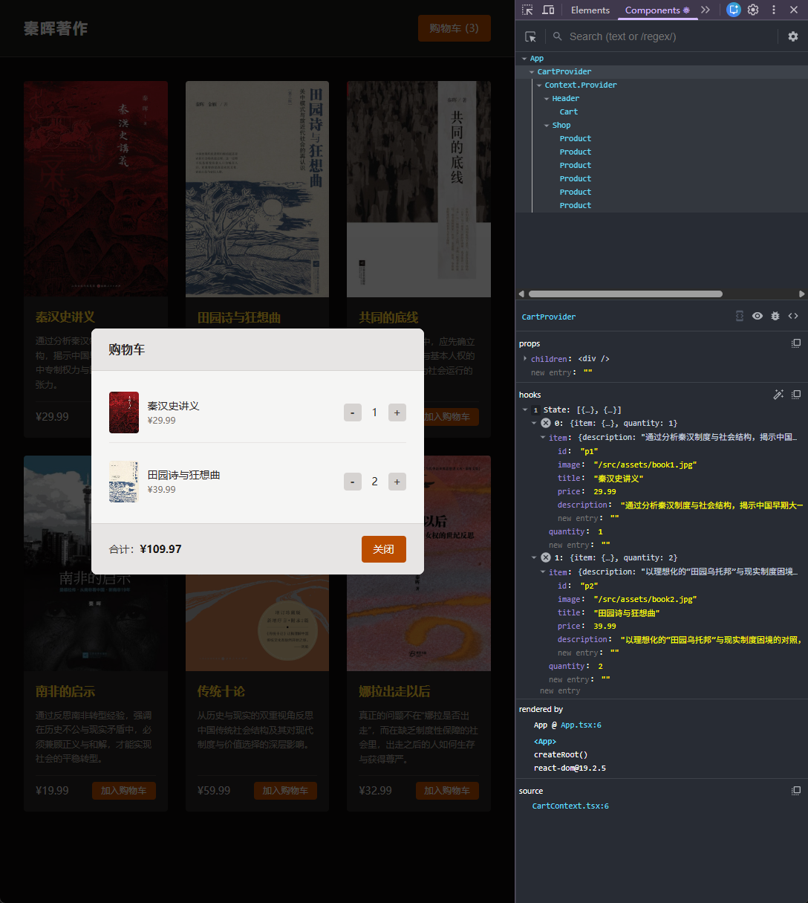

[← 返回首页](../readme.md)

# 第九章（二）- Context：解决 Props Drilling

上一章在购物车案例里暴露了 Props Drilling 的问题：`shoppingCart` 和操作函数在 `App`，但真正用到它们的是 `Product` 和 `Cart`，中间的 `Shop`、`Header` 只是被迫传递，什么都不消费。

本章用 **Context** 彻底消除这两条透传链。

> 示例代码：[codes/src](codes/src)

## 目录

1. [Context 的核心概念](#1-context-的核心概念)
2. [第一步：创建 CartContext](#2-第一步创建-cartcontext)
3. [第二步：用 Provider 包裹组件树](#3-第二步用-provider-包裹组件树)
4. [第三步：在组件里消费 Context](#4-第三步在组件里消费-context)
5. [自定义 Hook：useCart](#5-自定义-hookusecart)
6. [什么应该放进 Context](#6-什么应该放进-context)
7. [前后对比](#7-前后对比)

---

## 1. Context 的核心概念

React Context 是一个**跨层级的数据通道**。它让数据不需要经过中间组件逐层传递，任何层级的子组件都可以直接订阅并读取。

三个步骤：

```
createContext()  →  创建一个 Context 对象（数据容器）
<Context.Provider value={...}>  →  在组件树里放一个"广播站"，提供数据
useContext(Context)  →  在任意子组件里"收听"这个广播
```

---

## 2. 第一步：创建 CartContext

新建 `src/context/CartContext.tsx`。

**定义 Context 的类型和初始值：**

```tsx
interface CartContextType {
  cart: CartItem[];
  addItem: (id: string) => void;
  updateQuantity: (id: string, amount: number) => void;
}

const CartContext = createContext<CartContextType | null>(null);
```

`createContext` 接收一个默认值。这里传 `null` 是因为实际的数据由 `Provider` 提供——没有 `Provider` 包裹时消费这个 Context 是一个编程错误，`null` 能帮助暴露这种情况。

**创建 Provider 组件，把 state 和 handler 从 App 移进来：**

```tsx
export function CartProvider({ children }: { children: React.ReactNode }) {
  const [cart, setCart] = useState<CartItem[]>([]);

  function addItem(id: string) {
    setCart((prev) => {
      const updatedCart = prev.map((prod) => ({ ...prod }));
      const index = updatedCart.findIndex((prod) => prod.item.id === id);
      if (index !== -1) {
        updatedCart[index].quantity += 1;
      } else {
        const product = MOCK_PRODUCTS.find((p) => p.id === id);
        if (product) updatedCart.push({ item: product, quantity: 1 });
      }
      return updatedCart;
    });
  }

  function updateQuantity(id: string, amount: number) {
    setCart((prev) => {
      const updatedCart = prev.map((prod) => ({ ...prod }));
      const index = updatedCart.findIndex((prod) => prod.item.id === id);
      if (index !== -1) {
        updatedCart[index].quantity += amount;
        if (updatedCart[index].quantity <= 0) updatedCart.splice(index, 1);
      }
      return updatedCart;
    });
  }

  return (
    <CartContext.Provider value={{ cart, addItem, updateQuantity }}>
      {children}
    </CartContext.Provider>
  );
}
```

`CartProvider` 持有 `cart` state 和两个操作函数，通过 `CartContext.Provider` 的 `value` 向下广播。`children` 是被包裹的子组件树——任何渲染在 `CartProvider` 内部的组件，都能访问这个 Context。

---

## 3. 第二步：用 Provider 包裹组件树

`App.tsx` 现在只剩布局，state 和 handler 全部迁移进了 `CartProvider`：

```tsx
// 第一章的 App.tsx（有 state 和 handler）
function App() {
  const [shoppingCart, setShoppingCart] = useState<CartItem[]>([]);

  function handleAddItemToCart(id: string) { ... }
  function handleUpdateCartItemQuantity(id: string, amount: number) { ... }

  return (
    <div className="bg-stone-950 min-h-screen">
      <Header cart={shoppingCart} onUpdateCartItemQuantity={handleUpdateCartItemQuantity} />
      <Shop onAddItemToCart={handleAddItemToCart} />
    </div>
  );
}
```

```tsx
// 第二章的 App.tsx（只负责布局）
function App() {
  return (
    <CartProvider>
      <div className="bg-stone-950 min-h-screen">
        <Header />
        <Shop />
      </div>
    </CartProvider>
  );
}
```

`Header` 和 `Shop` 不再接收任何 props——它们各自通过 `useContext` 从 Context 取自己需要的数据。

---

## 4. 第三步：在组件里消费 Context

**`Product.tsx`** 直接读取 `addItem`，`onAddItemToCart` prop 彻底消失：

```tsx
// 第一章
export default function Product({ id, ..., onAddItemToCart }: ProductProps) {
  return (
    <button onClick={() => onAddItemToCart(id)}>加入购物车</button>
  );
}

// 第二章
export default function Product({ id, ... }: ProductProps) {
  const { addItem } = useContext(CartContext);

  return (
    <button onClick={() => addItem(id)}>加入购物车</button>
  );
}
```

`Shop` 不再需要接收和转发 `onAddItemToCart`，interface 和参数列表直接删掉：

```tsx
// 第一章
interface ShopProps { onAddItemToCart: (id: string) => void; }
export default function Shop({ onAddItemToCart }: ShopProps) {
  return MOCK_PRODUCTS.map((p) => <Product {...p} onAddItemToCart={onAddItemToCart} />);
}

// 第二章
export default function Shop() {
  return MOCK_PRODUCTS.map((p) => <Product {...p} />);
}
```

**`Cart.tsx`** 从 Context 取 `cart` 和 `updateQuantity`，只保留 `onClose` 作为 prop（它是 `Header` 的本地 UI 状态，不属于全局购物车数据）：

```tsx
// 第一章：三个 props
export default function Cart({ cart, onClose, onUpdateCartItemQuantity }: CartProps) { ... }

// 第二章：只剩一个 prop，其余从 Context 来
export default function Cart({ onClose }: CartProps) {
  const { cart, updateQuantity } = useContext(CartContext);
  ...
}
```

**`Header.tsx`** 不再接收任何 props，自己从 Context 取 `cart` 计算数量：

```tsx
// 第一章
export default function Header({ cart, onUpdateCartItemQuantity }: HeaderProps) { ... }

// 第二章
export default function Header() {
  const { cart } = useContext(CartContext);
  const cartQuantity = cart.reduce((acc, item) => acc + item.quantity, 0);
  ...
}
```

---

## 5. 自定义 Hook：useCart

每次写 `useContext(CartContext)` 有两个问题：

1. 需要在每个组件里都导入 `CartContext`，比较啰嗦
2. 如果组件在 `CartProvider` 外部使用，`useContext` 返回 `null`，但 TypeScript 认为它是合法的，不会报错

解决方案：把 `useContext` 包一层，做成自定义 Hook：

```tsx
export function useCart() {
  const context = useContext(CartContext);
  if (!context) throw new Error("useCart must be used within CartProvider");
  return context;
}
```

这样在组件里只需要：

```tsx
const { cart, addItem, updateQuantity } = useCart();
```

`CartContext` 本身不需要再从外部导出，也不需要被单独导入。

---

## 6. 什么应该放进 Context

本章把 `cart`、`addItem`、`updateQuantity` 放进了 Context，但 `isCartOpen` 没有放。这个选择是有意义的：

| 数据 | 放在哪里 | 原因 |
|---|---|---|
| `cart` | Context | 多个组件需要读取和修改 |
| `addItem` | Context | `Product` 需要，但 `Product` 在组件树深处 |
| `updateQuantity` | Context | `Cart` 需要，中间有 `Header` 隔着 |
| `isCartOpen` | `Header` 本地 state | 只有 `Header` 和 `Cart` 关心，是纯 UI 状态，不涉及购物车数据 |

**判断原则：** 一个数据是否需要跨越"不关心它的中间组件"到达目标组件——如果是，放进 Context；如果数据只在局部几个紧邻的组件间流动，用 props 更直接。

把所有 state 都放进 Context 反而是一种滥用，会让 Context 变成一个庞大的全局对象，难以维护。

---

## 7. 前后对比

**第一章（Props Drilling）：**

```
App（cart state + handlers）
  ↓ onAddItemToCart
Shop（不用，只传递）
  ↓ onAddItemToCart
Product（真正用到）

App（cart state + handlers）
  ↓ cart + onUpdateCartItemQuantity
Header（只用 cart 算数量，onUpdateCartItemQuantity 只传递）
  ↓ cart + onUpdateCartItemQuantity
Cart（真正用到）
```

**第二章（Context）：**

```
CartProvider（cart state + handlers）
  ↓ Context 广播
  ├── Header（useCart → cart）
  │   └── Cart（useCart → cart, updateQuantity）
  └── Shop
      └── Product（useCart → addItem）
```

中间层 `Shop` 和 `Header` 的 props interface 完全清空，不再承担任何透传责任。

---

## React DevTools 截图



截图中选中的是 `CartProvider` 组件，右侧 hooks 面板显示：

```
state: [{...}, {...}]
```

和第一章一样是 `useState`，但注意 state 现在住在 `CartProvider` 里，而不是 `App`。组件树变成了：

```
App > CartProvider > Context_Provider > Header > Cart > Shop > Product × 6
```

`CartProvider` 把 `Context_Provider` 包在里面——`Context_Provider` 是 React 内部的节点名，对应代码里的 `<CartContext.Provider>`。

关键变化在 `Header` 和 `Shop`：它们不再接收任何 props，interface 已经清空。state 从 `CartProvider` 通过 Context 广播，`Header`、`Cart`、`Product` 各自用 `useCart()` 直接取，中间层不再承担传递责任。

---

## 小结

| 概念 | 说明 |
|---|---|
| `createContext` | 创建 Context 对象，初始值传 `null` 表示必须由 Provider 提供实际值 |
| `<Context.Provider value={...}>` | 向子树广播数据，`value` 变化时所有消费者重新渲染 |
| `useContext` | 在任意深度的子组件里订阅 Context 值 |
| 自定义 Hook | 把 `useContext` 包一层，加入空值检查，同时简化导入 |
| 什么放进 Context | 需要跨越不关心它的中间组件时才放；纯局部 UI 状态留在本地 |
