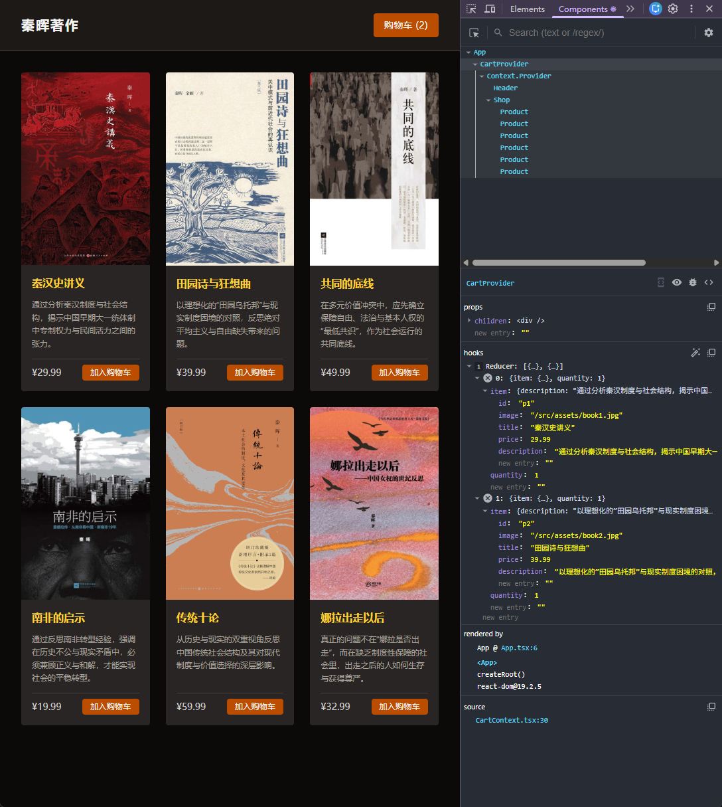

[← 返回首页](../readme.md)

# 第九章（三）- useReducer：集中管理复杂状态

上一章用 Context 解决了 Props Drilling，`CartProvider` 里的 state 和操作函数已经集中在一处。但仔细看 `addItem` 和 `updateQuantity` 这两个函数，它们各自包含一段操作 `cart` 数组的逻辑，相互独立地嵌在 `useState` 的 setter 回调里。

随着业务增长，这类操作函数会越来越多。本章引入 `useReducer`，把所有对 `cart` 的修改逻辑统一提取到一个纯函数里集中管理。

> 本章只修改了 `src/context/CartContext.tsx`，其他组件不变。
>
> 示例代码：[codes/src/context/CartContext.tsx](codes/src/context/CartContext.tsx)

## 目录

1. [useReducer 是什么](#1-usereducer-是什么)
2. [useState vs useReducer](#2-usestate-vs-usereducer)
3. [第一步：定义 Action 类型](#3-第一步定义-action-类型)
4. [第二步：编写 Reducer 函数](#4-第二步编写-reducer-函数)
5. [第三步：替换 useState](#5-第三步替换-usestate)
6. [完整改造对比](#6-完整改造对比)

---

## 1. useReducer 是什么

`useReducer` 的签名：

```tsx
const [state, dispatch] = useReducer(reducer, initialState);
```

和 `useState` 的区别在于更新方式：

```tsx
// useState：直接描述"新的值是什么"
setState(newValue);
setState(prev => computeNewValue(prev));

// useReducer：描述"发生了什么事"
dispatch({ type: "ADD_ITEM", id: "p1" });
dispatch({ type: "UPDATE_QUANTITY", id: "p1", amount: -1 });
```

`dispatch` 发送一个 **action**——一个描述事件的普通对象。React 把当前 state 和这个 action 一起交给 `reducer` 函数，由它计算并返回新的 state：

```tsx
function reducer(state: State, action: Action): State {
  switch (action.type) {
    case "ADD_ITEM":
      // 基于 state 和 action，计算新状态
      return newState;
    case "UPDATE_QUANTITY":
      return newState;
  }
}
```

`reducer` 是一个**纯函数**：相同的输入永远得到相同的输出，不产生任何副作用，不修改传入的参数。

---

## 2. useState vs useReducer

| | `useState` | `useReducer` |
|---|---|---|
| 适合场景 | 独立的简单值（布尔、数字、字符串） | 有结构的复合状态，多种操作共享同一份数据 |
| 更新方式 | 直接设置新值 | 派发 action，由 reducer 计算新值 |
| 逻辑位置 | 分散在各个事件处理函数里 | 集中在 reducer 函数里 |
| 可测试性 | 依赖组件环境 | reducer 是纯函数，可以单独测试 |

**什么时候用 useReducer？**

当你发现有多个函数在用不同的方式操作同一个 state，并且每个函数内部的逻辑都不简单时，就是切换到 `useReducer` 的信号。本章的购物车就是这样：`addItem` 和 `updateQuantity` 都在修改 `cart`，逻辑各有一段。

如果只是一个 `isOpen: boolean` 或 `count: number`，`useState` 足够，不需要引入 `useReducer`。

---

## 3. 第一步：定义 Action 类型

Action 是一个普通对象，必须有 `type` 字段标识这次操作是什么，其他字段携带操作所需的数据（称为 payload）。

购物车有两种操作，定义成联合类型：

```tsx
type CartAction =
  | { type: "ADD_ITEM"; id: string }
  | { type: "UPDATE_QUANTITY"; id: string; amount: number };
```

用 TypeScript 联合类型定义 action 有一个重要好处：在 reducer 的 `switch` 分支里，TypeScript 会自动收窄类型——在 `"ADD_ITEM"` 分支里，`action.amount` 不存在，编译器会报错而不是静默地拿到 `undefined`。

---

## 4. 第二步：编写 Reducer 函数

把 `addItem` 和 `updateQuantity` 里的逻辑搬进 reducer，用 `switch` 按 action 类型分发：

```tsx
function cartReducer(state: CartItem[], action: CartAction): CartItem[] {
  switch (action.type) {
    case "ADD_ITEM": {
      const updatedCart = state.map((prod) => ({ ...prod }));
      const index = updatedCart.findIndex((prod) => prod.item.id === action.id);
      if (index !== -1) {
        updatedCart[index].quantity += 1;
      } else {
        const product = MOCK_PRODUCTS.find((p) => p.id === action.id);
        if (product) updatedCart.push({ item: product, quantity: 1 });
      }
      return updatedCart;
    }
    case "UPDATE_QUANTITY": {
      const updatedCart = state.map((prod) => ({ ...prod }));
      const index = updatedCart.findIndex((prod) => prod.item.id === action.id);
      if (index !== -1) {
        updatedCart[index].quantity += action.amount;
        if (updatedCart[index].quantity <= 0) updatedCart.splice(index, 1);
      }
      return updatedCart;
    }
  }
}
```

每个 `case` 用花括号 `{}` 包裹，避免不同分支的变量名冲突。

`cartReducer` 是一个组件外的**普通函数**，不依赖任何 React hook，随时可以单独测试：

```ts
const state = [{ item: book1, quantity: 2 }];
const next = cartReducer(state, { type: "ADD_ITEM", id: "p1" });
// 直接断言 next 的内容，不需要 render 组件
```

---

## 5. 第三步：替换 useState

`CartProvider` 里的变化非常小：

```tsx
// 第二章
const [cart, setCart] = useState<CartItem[]>([]);

function addItem(id: string) {
  setCart((prev) => {
    // 一段逻辑...
  });
}

function updateQuantity(id: string, amount: number) {
  setCart((prev) => {
    // 另一段逻辑...
  });
}
```

```tsx
// 第三章
const [cart, dispatch] = useReducer(cartReducer, []);

function addItem(id: string) {
  dispatch({ type: "ADD_ITEM", id });
}

function updateQuantity(id: string, amount: number) {
  dispatch({ type: "UPDATE_QUANTITY", id, amount });
}
```

`addItem` 和 `updateQuantity` 变成了只有一行的 dispatch 调用，所有计算逻辑都在 `cartReducer` 里。

`CartContextType` 接口、`CartContext`、`useCart`、以及 JSX 部分完全不变——Context 的消费方（`Product`、`Cart`、`Header`）感知不到这次重构。

---

## 6. 完整改造对比

**第二章 `CartContext.tsx`（useState 版）：**

```tsx
export function CartProvider({ children }) {
  const [cart, setCart] = useState<CartItem[]>([]);

  function addItem(id) {
    setCart((prev) => {
      const updatedCart = prev.map((prod) => ({ ...prod }));
      const index = updatedCart.findIndex((prod) => prod.item.id === id);
      if (index !== -1) {
        updatedCart[index].quantity += 1;
      } else {
        const product = MOCK_PRODUCTS.find((p) => p.id === id);
        if (product) updatedCart.push({ item: product, quantity: 1 });
      }
      return updatedCart;
    });
  }

  function updateQuantity(id, amount) {
    setCart((prev) => {
      const updatedCart = prev.map((prod) => ({ ...prod }));
      const index = updatedCart.findIndex((prod) => prod.item.id === id);
      if (index !== -1) {
        updatedCart[index].quantity += amount;
        if (updatedCart[index].quantity <= 0) updatedCart.splice(index, 1);
      }
      return updatedCart;
    });
  }

  return <CartContext.Provider value={{ cart, addItem, updateQuantity }}>{children}</CartContext.Provider>;
}
```

**第三章 `CartContext.tsx`（useReducer 版）：**

```tsx
// 逻辑集中在这里
function cartReducer(state: CartItem[], action: CartAction): CartItem[] {
  switch (action.type) {
    case "ADD_ITEM": { /* ... */ }
    case "UPDATE_QUANTITY": { /* ... */ }
  }
}

// Provider 变得很薄
export function CartProvider({ children }) {
  const [cart, dispatch] = useReducer(cartReducer, []);

  const addItem = (id: string) => dispatch({ type: "ADD_ITEM", id });
  const updateQuantity = (id: string, amount: number) => dispatch({ type: "UPDATE_QUANTITY", id, amount });

  return <CartContext.Provider value={{ cart, addItem, updateQuantity }}>{children}</CartContext.Provider>;
}
```

`CartProvider` 从一个夹带了大量逻辑的函数，变成一个只负责"接线"的薄层：它知道有哪些操作，但不关心操作的细节——细节都在 `cartReducer` 里。

---

## React DevTools 截图



截图中依然选中 `CartProvider`，右侧 hooks 面板这次显示：

```
reducer: [{...}, {...}]
```

上一章这里是 `state`，本章换成了 `reducer`——React DevTools 能识别 `useReducer`，并把它标注为 `reducer` 而不是 `state`，以示区别。

数据内容和上一章相同（购物车里同样是两本书），组件树结构也没有变化。这印证了本章开头说的：`useReducer` 是一次纯粹的内部重构，对外——无论是组件树结构还是 UI 行为——完全没有影响，变化只发生在 `CartContext.tsx` 内部。

---

## 小结

| 概念 | 说明 |
|---|---|
| `useReducer(reducer, initialState)` | 返回 `[state, dispatch]`，以 action 驱动状态更新 |
| Action | 描述"发生了什么"的普通对象，`type` 字段标识操作类型 |
| Reducer | 纯函数，接收 `(state, action)`，返回新 state，不产生副作用 |
| `dispatch` | 发送 action，触发 reducer 计算新 state |
| 适用场景 | 多个操作共享同一份复杂状态；需要集中管理、方便测试 |
| 不适用场景 | 简单的独立值（布尔、数字），`useState` 更直接 |

三章购物车案例到这里完整演示了一条 React 状态管理的进化路线：

```
单组件 useState（第一章）
  → 提升 state + Props Drilling（第一章末）
    → Context 消除透传（第二章）
      → useReducer 集中逻辑（第三章）
```
