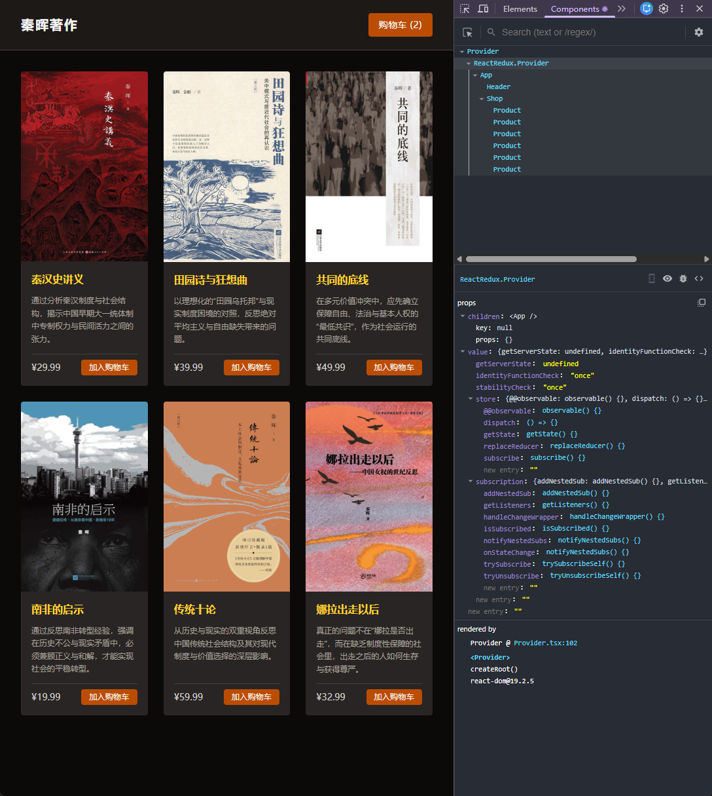
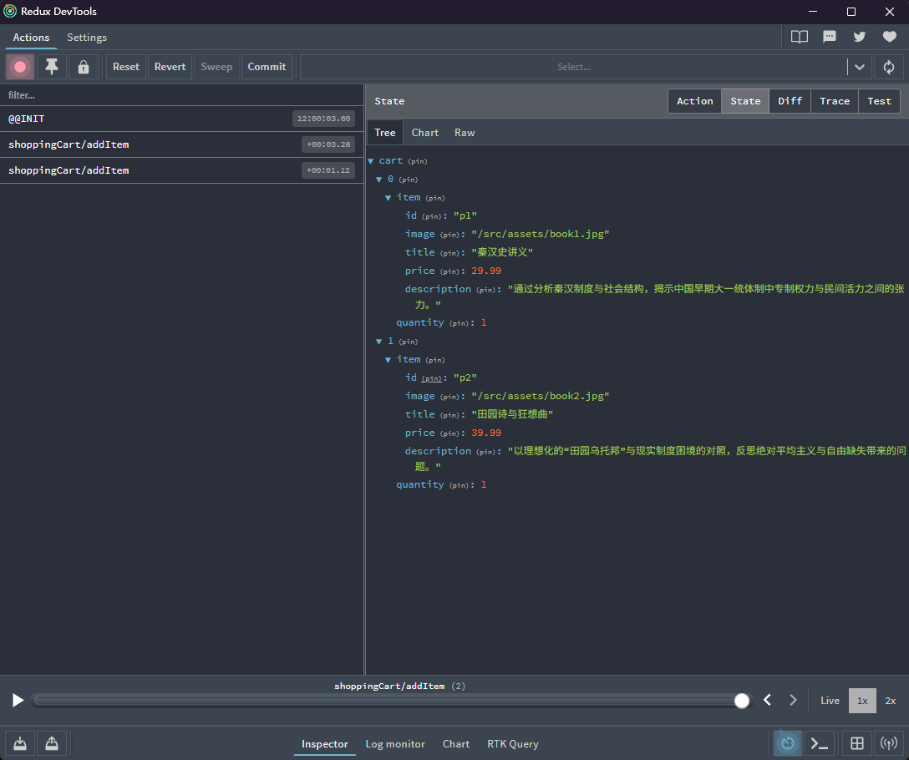

[← 返回首页](../readme.md)

# 第九章（四）- Redux：组件外的全局状态管理

在正式开始之前，先把上一章引入的两个词说清楚——它们在 Redux 里会继续沿用，字面意思也值得理解一次。

**reducer** 来自函数式编程的 `reduce` 操作。`Array.prototype.reduce` 把一个序列"折叠"成一个值，每一步拿着当前的累积结果和新来的元素，产出下一个累积结果：

```js
// Array.reduce
(accumulator, currentValue) => newAccumulator

// reducer
(state, action) => newState
```

把"历史上所有发生过的 action"看成一个序列，reducer 就是把这个序列一步步折叠成当前 state 的函数。字面理解：**把（当前状态 + 一件新发生的事）归约成下一个状态的函数**。

**dispatch** 是英语动词，本义是**"派遣、调度、发送"**。在 `useReducer` 和 Redux 里，`dispatch` 的职责是把一个 action 发送出去交给 reducer 处理。调用者只描述"发生了什么事"，不关心 reducer 怎么处理——就像调度中心发出指令，不管执行细节。

```
组件            →   dispatch(action)   →   reducer   →   新 state
"发生了什么事"       发送出去               怎么变          结果
```

这个分工是有意为之的：职责分离，reducer 是纯函数可以单独测试，组件不需要知道状态的计算细节。

---

上一章用 Context + `useReducer` 管理购物车状态，整体已经很清晰。但 Context 有一个内在限制：只要 `CartProvider` 的 `value` 发生变化，所有消费了这个 Context 的组件都会重新渲染，不管它们实际用到的数据有没有变。

本章引入 **Redux Toolkit**，把状态从 React 组件树里完全抽离出来，放进一个独立的 **store**。组件通过 `useSelector` 精确订阅自己需要的那一片数据，只在那片数据变化时才重新渲染。

> 本章修改了 `main.tsx`、`App.tsx`，以及三个组件；删除了 `context/CartContext.tsx`；新增了 `src/store/` 目录。
>
> 示例代码：[codes/src](codes/src)

## 目录

1. [Redux 是什么，和 Context 有什么区别](#1-redux-是什么和-context-有什么区别)
2. [Redux Toolkit 的核心概念](#2-redux-toolkit-的核心概念)
3. [第一步：创建 cartSlice](#3-第一步创建-cartslice)
4. [第二步：创建 store](#4-第二步创建-store)
5. [第三步：用 Provider 连接 React](#5-第三步用-provider-连接-react)
6. [第四步：在组件里使用 Redux 状态](#6-第四步在组件里使用-redux-状态)
7. [Immer：为什么可以直接修改 state](#7-immer为什么可以直接修改-state)
8. [Context vs Redux 对比](#8-context-vs-redux-对比)

---

## 1. Redux 是什么，和 Context 有什么区别

**Redux 是一个独立的第三方状态管理库**，由 Dan Abramov 和 Andrew Clark 于 2015 年创建，目前由 Redux 团队维护，和 React 官方团队（Meta/Facebook）没有关系。虽然 Redux 在 React 生态里使用最广，但它本身与框架无关——Vue、Angular 或纯 JavaScript 项目里同样可以使用。专门为 React 提供绑定的是另一个配套库 `react-redux`，`useSelector` 和 `useDispatch` 都来自这里。

2019 年，Redux 团队发布了 **Redux Toolkit**（RTK），作为官方推荐的使用方式，大幅减少了原始 Redux 的样板代码。本章用的就是 RTK。

Context 是 React 内置的跨层级数据传递机制，状态存在于组件树里（`CartProvider` 是一个组件）。Redux 是一个独立的状态管理库，状态存在于 React 组件树**之外**的 store 对象里。

从数据流角度看：

```
Context 模型：
  CartProvider（React 组件，持有 state）
    → Context 广播
      → 消费者组件订阅整个 context 值

Redux 模型：
  store（React 之外的普通对象，持有 state）
    → useSelector（精确订阅 state 的某一片段）
      → 消费者组件只在那一片段变化时重新渲染
```

Context 的重渲染问题在小应用里通常不明显，但当 Context value 里有多个字段、消费组件众多时，任何一个字段的变化都会触发所有消费者重渲染。Redux 的 `useSelector` 通过引用比较做了细粒度优化，只有选取的值真正变化时才触发渲染。

---

## 2. Redux Toolkit 的核心概念

Redux 原本要求大量样板代码。**Redux Toolkit**（官方推荐的工具包，缩写 RTK）把常见模式封装好，让 Redux 变得简洁。

本章用到三个核心 API：

| API                           | 作用                                                             |
| ----------------------------- | ---------------------------------------------------------------- |
| `createSlice`                 | 一次性定义 reducer + action creators，替代手写 action 类型字符串 |
| `configureStore`              | 创建 store，整合一个或多个 slice                                 |
| `useSelector` / `useDispatch` | 在组件里读取状态 / 派发 action                                   |

---

## 3. 第一步：创建 cartSlice

新建 `src/store/cartSlice.ts`。

`createSlice` 接收一个配置对象，包含 `name`（命名空间）、`initialState`（初始值）、`reducers`（操作方法）：

```ts
import { createSlice, type PayloadAction } from "@reduxjs/toolkit";
import { MOCK_PRODUCTS, type CartItem } from "../data";

const cartSlice = createSlice({
  name: "shoppingCart",
  initialState: [] as CartItem[],
  reducers: {
    addItem(state, action: PayloadAction<string>) {
      const index = state.findIndex((prod) => prod.item.id === action.payload);
      if (index !== -1) {
        state[index].quantity += 1;
      } else {
        const product = MOCK_PRODUCTS.find((p) => p.id === action.payload);
        if (product) state.push({ item: product, quantity: 1 });
      }
    },
    updateQuantity(state, action: PayloadAction<{ id: string; amount: number }>) {
      const index = state.findIndex((prod) => prod.item.id === action.payload.id);
      if (index !== -1) {
        state[index].quantity += action.payload.amount;
        if (state[index].quantity <= 0) state.splice(index, 1);
      }
    },
  },
});

export const { addItem, updateQuantity } = cartSlice.actions;
export default cartSlice.reducer;
```

和上一章的 `cartReducer` 对比：

**上一章（手写 reducer）：**

```ts
type CartAction =
  | { type: "ADD_ITEM"; id: string }
  | { type: "UPDATE_QUANTITY"; id: string; amount: number };

function cartReducer(state: CartItem[], action: CartAction): CartItem[] {
  switch (action.type) {
    case "ADD_ITEM": {
      const updatedCart = state.map((prod) => ({ ...prod }));
      const index = updatedCart.findIndex((prod) => prod.item.id === action.id);
      if (index !== -1) {
        updatedCart[index].quantity += 1;
      } else {
        const product = MOCK_PRODUCTS.find((p) => p.id === action.id);
        if (product) updatedCart.push({ item: product, quantity: 1 });
      }
      return updatedCart;
    }
    case "UPDATE_QUANTITY": { ... }
  }
}
```

**本章（createSlice）：**

- 不再需要手写 `type: "ADD_ITEM"` 这样的字符串常量——`createSlice` 自动生成
- 不再需要 `state.map((prod) => ({ ...prod }))` 手动复制数组——RTK 内置 Immer，可以直接修改（见[第 7 节](#7-immer为什么可以直接修改-state)）
- `cartSlice.actions` 自动导出与 reducer 同名的 **action creator 函数**：`addItem("p1")` 会返回 `{ type: "shoppingCart/addItem", payload: "p1" }`

`PayloadAction<T>` 是 RTK 提供的泛型，用于给 action 的 `payload` 字段标注类型。

---

## 4. 第二步：创建 store

新建 `src/store/store.ts`：

```ts
import { configureStore } from "@reduxjs/toolkit";
import cartReducer from "./cartSlice";

export const store = configureStore({
  reducer: {
    cart: cartReducer,
  },
});

export type RootState = ReturnType<typeof store.getState>;
export type AppDispatch = typeof store.dispatch;
```

`configureStore` 的 `reducer` 字段是一个对象，每个键对应 state 树里的一个字段名。这里 `cart: cartReducer` 意味着整个 Redux state 的结构是 `{ cart: CartItem[] }`，组件里通过 `state.cart` 取到购物车数组。

`RootState` 和 `AppDispatch` 是两个导出的类型，组件里用它们来标注 `useSelector` 和 `useDispatch` 的类型，避免每次手写。

---

## 5. 第三步：用 Provider 连接 React

Redux 通过 `react-redux` 提供的 `<Provider>` 组件把 store 注入到 React 组件树。把它放在 `main.tsx` 最外层：

```tsx
// main.tsx
import { Provider } from "react-redux";
import { store } from "./store/store";

createRoot(document.getElementById("root")!).render(
  <StrictMode>
    <Provider store={store}>
      <App />
    </Provider>
  </StrictMode>,
);
```

`App.tsx` 现在连 `CartProvider` 也不需要了：

```tsx
// 上一章的 App.tsx
function App() {
  return (
    <CartProvider>
      <div className="bg-stone-950 min-h-screen">
        <Header />
        <Shop />
      </div>
    </CartProvider>
  );
}

// 本章的 App.tsx
function App() {
  return (
    <div className="bg-stone-950 min-h-screen">
      <Header />
      <Shop />
    </div>
  );
}
```

状态管理从 React 组件树里完全消失，`App` 真正只剩布局。

---

## 6. 第四步：在组件里使用 Redux 状态

上一章三个组件都用 `useCart()` 从 Context 取数据。本章用 `useSelector` 读取状态，用 `useDispatch` 派发 action。

**`Product.tsx`——只需要 dispatch：**

```tsx
// 上一章
const { addItem } = useCart();
<button onClick={() => addItem(id)}>加入购物车</button>;

// 本章
const dispatch = useDispatch<AppDispatch>();
<button onClick={() => dispatch(addItem(id))}>加入购物车</button>;
```

**`Header.tsx`——只需要读取 cart：**

```tsx
// 上一章
const { cart } = useCart();

// 本章
const cart = useSelector((state: RootState) => state.cart);
```

`useSelector` 接收一个选择器函数，从完整的 Redux state 里取出组件需要的那一片。这里取 `state.cart`，对应 store 里 `reducer: { cart: cartReducer }` 定义的键名。

**`Cart.tsx`——需要读取和修改：**

```tsx
// 上一章
const { cart, updateQuantity } = useCart();
<button onClick={() => updateQuantity(prod.item.id, -1)}>-</button>
<button onClick={() => updateQuantity(prod.item.id, 1)}>+</button>

// 本章
const cart = useSelector((state: RootState) => state.cart);
const dispatch = useDispatch<AppDispatch>();
<button onClick={() => dispatch(updateQuantity({ id: prod.item.id, amount: -1 }))}>-</button>
<button onClick={() => dispatch(updateQuantity({ id: prod.item.id, amount: 1 }))}>+</button>
```

注意 action creator 的调用方式：`addItem(id)` 的 payload 是字符串，直接传；`updateQuantity({ id, amount })` 的 payload 是对象，对应 `PayloadAction<{ id: string; amount: number }>` 的定义。

---

## 7. Immer：为什么可以直接修改 state

Redux 原则之一是 reducer 必须是纯函数，不能修改传入的 state，要返回一个新对象。这就是上一章要写 `state.map((prod) => ({ ...prod }))` 的原因——先复制，再修改副本。

RTK 的 `createSlice` 内置了 **Immer** 库。Immer 用 JavaScript Proxy 把 state 包裹起来，记录所有的"修改操作"，最终自动生成一个新的不可变对象。

所以在 `createSlice` 的 `reducers` 里：

```ts
// 看起来在直接修改，实际上 Immer 在背后生成了新对象
addItem(state, action: PayloadAction<string>) {
  const index = state.findIndex((prod) => prod.item.id === action.payload);
  if (index !== -1) {
    state[index].quantity += 1;   // 直接改，不需要复制
  } else {
    state.push({ item: product, quantity: 1 });   // 直接 push
  }
},
```

等价于上一章的：

```ts
case "ADD_ITEM": {
  const updatedCart = state.map((prod) => ({ ...prod }));  // 手动复制
  const index = updatedCart.findIndex(...);
  if (index !== -1) {
    updatedCart[index].quantity += 1;
  } else {
    updatedCart.push(...);
  }
  return updatedCart;  // 必须 return 新对象
}
```

**注意**：这种"可以直接修改"的写法只在 `createSlice` 的 `reducers` 里有效，其他地方的 Redux state 仍然是不可变的，不能直接修改。

---

## 8. Context vs Redux 对比

|              | Context + useReducer                    | Redux Toolkit                                          |
| ------------ | --------------------------------------- | ------------------------------------------------------ |
| 状态存放位置 | React 组件树内（Provider 是组件）       | React 组件树外（独立 store 对象）                      |
| 重渲染粒度   | Provider value 变化时，所有消费者重渲染 | `useSelector` 选取的片段变化时才重渲染                 |
| 样板代码     | 需要手写 action 类型、手动复制 state    | `createSlice` 自动生成 action creators，Immer 消除复制 |
| 调试工具     | React DevTools                          | Redux DevTools（可回放每一次 action）                  |
| 适用规模     | 中小型应用，状态结构简单                | 中大型应用，多个独立 state 模块，或需要精细优化        |

**什么时候用 Redux？**

- 多个不相关的功能模块共享状态，Context 会变成一个庞大的全局对象
- 遇到明显的性能问题，需要精确控制哪些组件在何时重渲染
- 需要 Redux DevTools 的时间旅行调试能力
- 团队已经在用，保持一致性

对于本章的购物车案例，Context 本已足够。引入 Redux 主要是为了演示它的概念和 API——在实际项目里，引入一个库的标准是"有真实的需求"，而不是"可以用"。

---

## 开发工具截图

**React DevTools：**



选中的是 `ReactRedux_Provider`——这是 `react-redux` 的 `<Provider>` 组件在 DevTools 里的名字。注意组件树：

```
Provider > App > Header > Shop > Product × 6
```

和前三章相比，树里没有了 `CartProvider`，也没有了 `Context_Provider`。

右侧面板里看不到任何购物车数据，只能看到 store 的公开方法：`dispatch`、`getState`、`subscribe` 等。这不是工具的局限，而是架构决定的结果：**购物车数据住在 Redux store 里，store 是 React 组件树之外的独立对象**。React DevTools 只追踪 React 的 state 和 props，store 的内部状态对它是不透明的——它能看到的只有 store 暴露出来的 API 方法。

要看到真正的购物车数据，需要换用 Redux DevTools。

---

**Redux DevTools：**



这是 Redux 专属的调试工具。左侧是 action 历史，可以看到两条记录：

- `@@INIT`——store 初始化时自动触发，这是 Redux 的内置 action
- `shoppingCart/addItem`——点击"加入购物车"时触发，命名格式是 `slice名/reducer方法名`，正是 `createSlice` 里 `name: "shoppingCart"` 和 `addItem` 拼出来的

右侧 State 面板展示了当前完整的 Redux state，可以看到 cart 数组里的两本书，以及每本书的完整数据结构。

Redux DevTools 的核心能力是**时间旅行**：点击左侧任意一条历史 action，右侧状态立刻回退到那一刻。这在调试复杂交互时非常有价值，而 Context 没有对应的工具支持。

---

## 小结

### 一脉相承：从 useReducer 到 Redux

读到这里可能会发现，Redux 和第三章的 `useReducer` 长得非常像——都有 reducer 函数、都用 dispatch 发 action、都要求 reducer 是纯函数。这不是巧合。

Redux 诞生于 2015 年，比 `useReducer`（2018 年随 React Hooks 一起发布）早了三年。`useReducer` 在设计上直接借鉴了 Redux 的 reducer 模式，可以理解为"React 内置的迷你 Redux"。

两者的核心思想完全一致：

```
旧 state + action  →  reducer  →  新 state
```

区别只在于 store 放在哪里：

|            | useReducer                              | Redux                                    |
| ---------- | --------------------------------------- | ---------------------------------------- |
| store 位置 | React 组件内（`CartProvider` 是个组件） | React 组件树之外（独立对象）             |
| 数据共享   | 通过 Context 广播                       | 通过 `react-redux` 的 `useSelector` 订阅 |
| 作用范围   | 限于当前组件树，Provider 之内           | 全局，任何组件都能访问                   |

所以四章购物车案例是真正一脉相承的：

```
useState（第一章）
  → 状态逻辑分散在各个 handler 里，state 住在 App，通过 props 逐层传递

Context + useState（第二章）
  → 用 CartProvider 消除 Props Drilling，任意组件直接取数据
  → state 的操作逻辑仍分散在各个 handler 函数里

Context + useReducer（第三章）
  → 引入 reducer + action 模型，把所有对 state 的修改集中到一个纯函数
  → "描述发生了什么" 取代 "直接设置新值"

Redux Toolkit（第四章）
  → 沿用完全相同的 reducer + action 模型
  → 把 store 从 React 组件树里搬出去，变成框架无关的独立对象
  → createSlice 省掉手写 action 类型的样板代码，Immer 省掉手动复制 state
```

理解了第三章的 `useReducer`，第四章的 Redux 概念上没有任何新东西——只是同一个模式换了一套 API，并且搬到了 React 之外。

---

四章购物车案例完整演示了 React 状态管理的演进路线：

```
单组件 useState（第一章）state + Props Drilling
    → Context 消除透传（第二章）
        → useReducer 集中逻辑（第三章）
            → Redux 抽离到组件树外（第四章）
```

| 概念                       | 说明                                                                |
| -------------------------- | ------------------------------------------------------------------- |
| `createSlice`              | 定义 reducer + 自动生成 action creators，内置 Immer                 |
| `configureStore`           | 创建 store，组合多个 slice reducer                                  |
| `<Provider store={store}>` | 把 store 注入 React 组件树                                          |
| `useSelector`              | 精确订阅 state 的某一片段                                           |
| `useDispatch`              | 获取 dispatch 函数，用于派发 action                                 |
| `PayloadAction<T>`         | RTK 提供的泛型，标注 action payload 的类型                          |
| Immer                      | RTK 内置，让 reducer 可以写"可变风格"代码，背后自动产生不可变新对象 |
